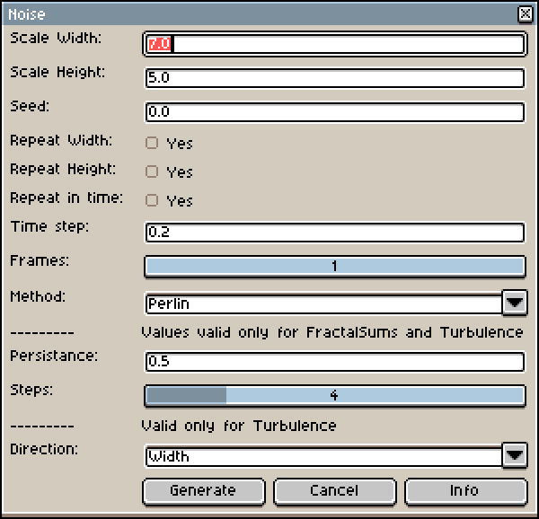

# AseWave

Water & Clouds generation plugin for Aseprite editor.


## UI
UI is basic and shows all values even if they do not apply for particular method. Screenshot of UI and explanation of individual entries are:



### Options description

- `Scale width` is a number of waves in width direction. Higher number means more waves.
- `Scale height` the same for height
- `Seed` different seed changes initial noise pattern
- `Repeat Width` checkbox enables to tile texture in width direction
- `Repeat Height` enables to tile in height 
- `Repeat in time` enables to create endless loop animation 
- `Time step` says how fast animation changes between two frames (ignored for a single frame)
- `Frames` number of frames to generate. Default is 1, e.g. no animation
- `Method` you can choose which method is used to generate texture. Options are `Perlin` `FractalSum` `FractalSumAbs` and `Turbulence`
### Options valid only for FractalSum, FractalSumAbs and Turbulence method
- `Persistance` says how much huch contributes next step to final image. Value 0.5 means that next image has 50 % contribution, next one 25% etc. (0.5*0.5=0.25)
- `Steps` number of times the basic Perlin method is applied to final image
### Options valid only for Turbulence
- `Direction` in which is Turbulence running through image. Width means it will go from left to right.

All methods use Perlin noise method for generation of random field.

## Installation

Copy `AseWave.lua` into your Aseprite script folder and press `F5` inside the editor to refresh its content. 

Scripts folder can be found like this: 

``` 
File -> Scripts -> Open Scripts Folder
```


## Credit

This plugin is originally based on source code and ideas described below:

<https://github.com/RenFinkle/noisy>

<https://github.com/weswigham/simplex/tree/master/lua>

<https://adrianb.io/2014/08/09/perlinnoise.html>

<https://ronvalstar.nl/creating-tileable-noise-maps>

- With nice examples in Shadertoy as well:

<https://gpfault.net/posts/perlin-noise.txt.html>

<https://www.scratchapixel.com/lessons/procedural-generation-virtual-worlds/perlin-noise-part-2>

<https://www.scratchapixel.com/lessons/procedural-generation-virtual-worlds/procedural-patterns-noise-part-1/simple-pattern-examples>
